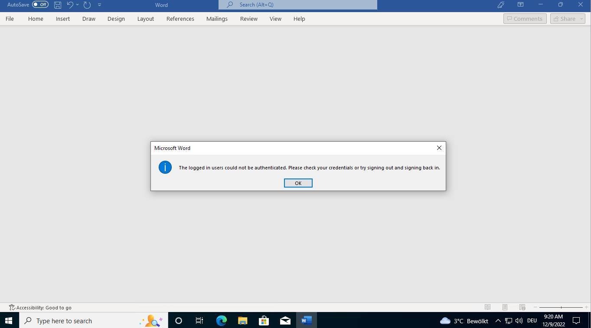

# OPA policies for THALES Luna Key Broker for DKE

Set of REGO files with authorization policies for THALES Luna Key Broker for DKE. To debug your policies and their effect, you can switch on the debug logging on LKB by using the environment variable `DEBUG_LOGGING_ENABLED=true`.

All policies have been verified as working with LKB v1.1.2 on 2022-12-09.

## How to test policies?

Get the `opa` executable for your system as described at <https://www.openpolicyagent.org/docs/latest/#1-download-opa> and follow the commands below.

```shell
# Change int to directory of the policy you want to test
cd ./allow-existing-upn
# Run the tests
opa test . -v
```

## What do I see, if access was denied?

Filter for the message `desc = not authorized to perform decrypt operation` as seen in the logs below. To get the service logs you can...

* `journalctl -u lkbd.service -n 20 -f` to trace the logs of your DKE service when run as linux service
* `docker logs ...` to get the logs of your container when run dockerized

```log
Dec 09 09:14:22 dke-service lkb4dke[9751]: time="2022-12-09T09:14:22Z" level=info msg="Decrypt keyName: DKE-Key-001 keyId: b76d58ef4e92b53af5f7f16cb4b1c116 upn: \"user.one@o365.presales.dev\""
Dec 09 09:14:22 dke-service lkb4dke[9751]: time="2022-12-09T09:14:22Z" level=info msg="finished unary call with code Unauthenticated" claims=n/a error="rpc error: code = Unauthenticated desc = not authorized to perform decrypt operation" grpc.code=Unauthenticated grpc.method=Decrypt grpc.service=azure.dke.v1.AzureDKEKeyManagementService grpc.start_time="2022-12-09T09:14:22Z" grpc.time_ms=1.419 span.kind=server system=grpc
```

On your AIP client your should see the following message displayed:


